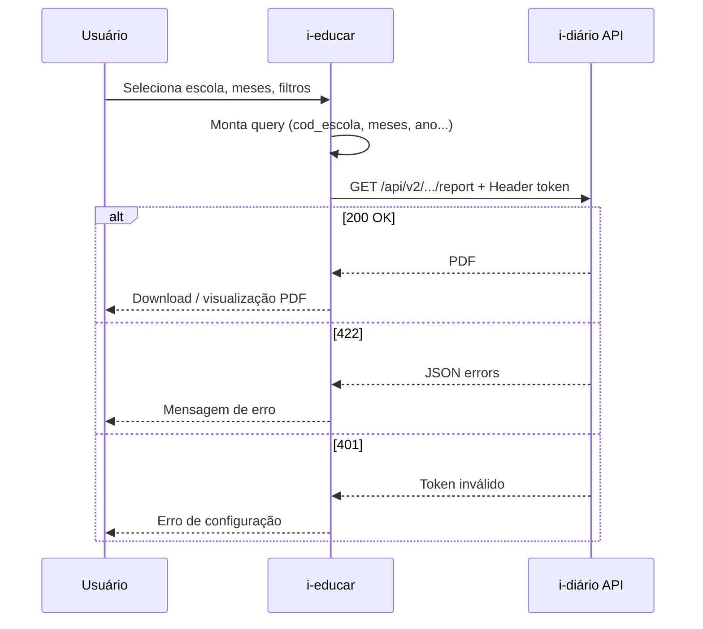

# Integração i-educar → i-diário

## Relatório: Frequência para o Sistema Presença

Documentação técnica para consumo da API que gera o PDF de faltas mensais por aluno, destinada à equipe de desenvolvimento do i-educar.

---

## 1. Visão geral

O i-diário expõe um endpoint HTTP que retorna um **PDF pronto para impressão/envio**, com a frequência (quantidade de dias com falta) por aluno, agrupada por mês.

| Item | Valor |
|------|--------|
| **Sistema emissor** | i-educar (cliente HTTP) |
| **Sistema provedor** | i-diário |
| **Formato da resposta** | `application/pdf` |
| **Autenticação** | Header `token` (token de segurança do i-diário) |
| **Uso típico** | Botão/link no i-educar que abre ou baixa o relatório para integração com o Sistema Presença |

Não é necessário login de usuário no i-diário (sessão web). A chamada é **servidor → servidor** ou **backend → API**.

---

## 2. Pré-requisitos

### 2.1 No i-diário (configuração pela rede/entidade)

1. **API de integração** configurada (`/api-de-integracao`), com URL do i-educar, tokens de sincronização etc.
2. **Token de segurança do i-diário** (`api_security_token`) — usado pelo i-educar para chamar a API v2.
3. Escolas sincronizadas com **`api_code`** preenchido (equivale ao `cod_escola` do i-educar).
4. Frequências lançadas no i-diário para o ano/meses desejados.

### 2.2 Onde salvar no i-Educar o token e URL do i-Diario

- Copie o token no diário na interface: **API de integração** → campo **Token de segurança do i-diário** (usuário administrador).
- no i-Educar acesse Configurações -> Configurações Gerais e preencha os campos:
--- URL de integração (API): salve a URL do i-diario
--- Token de integração (API): Cole o Token de segurança do i-diario

### 2.3 Correspondência de códigos

| Conceito i-educar | Campo no i-diário | Parâmetro na API |
|-------------------|-------------------|------------------|
| Código da escola (`cod_escola`) | `Unity.api_code` | `cod_escola` |
| Série (opcional) | `Grade.id` (ID interno) | `serie_id` |
| Turma (opcional) | `Classroom.id` (ID interno) | `turma_id` |

> **Importante:** `serie_id` e `turma_id` são os **IDs numéricos do banco do i-diário**, não os códigos da API do i-educar. É necessário manter mapeamento após sincronização (tabelas locais, cache ou consulta prévia). O `cod_escola` é o identificador principal e já é o mesmo entre os sistemas.

---

## 3. Endpoint

### 3.1 Requisição

```
GET {BASE_URL_IDIARIO}/api/v2/monthly_absence_by_student_reports/report
```

**Exemplo de base URL:** `https://idiario.prefeitura.exemplo.gov.br`

### 3.2 Headers obrigatórios

| Header | Valor |
|--------|--------|
| `token` | Token de segurança do i-diário (`api_security_token`) |

### 3.3 Headers recomendados

| Header | Valor |
|--------|--------|
| `Accept` | `application/pdf` |

### 3.4 Query string — parâmetros

#### Obrigatórios

| Parâmetro | Alternativa | Tipo | Descrição | Exemplo |
|-----------|-------------|------|-------------|---------|
| `cod_escola` | `unity_api_code` | string | Código da escola no i-educar (`Unity.api_code`) | `12345` |
| `meses` | `months` | string | Meses do ano (1–12), separados por vírgula | `2,3,4` |

#### Opcionais

| Parâmetro | Alternativa | Tipo | Padrão | Descrição |
|-----------|-------------|------|--------|-----------|
| `ano` | `year` | inteiro | ano atual | Ano letivo das frequências | `2026` |
| `serie_id` | `grade_id` | inteiro | — | Filtra por série (ID no i-diário) |
| `turma_id` | `classroom_id` | inteiro | — | Filtra por turma (ID no i-diário) |
| `ordenar` | `sort_by` | string | `student_name` | Ordenação (ver seção 5) |

**Locale (opcional):** `locale=pt-BR` — recomendado para nomes de meses em português no PDF.

---

## 4. Respostas HTTP

### 4.1 Sucesso — `200 OK`

| Campo | Valor |
|-------|--------|
| `Content-Type` | `application/pdf` |
| `Content-Disposition` | `inline; filename="faltas_mensais_{cod_escola}_{ano}.pdf"` |
| Corpo | Binário do PDF |

### 4.2 Erro de autenticação — `401 Unauthorized`

```json
{
  "errors": "Token inválido"
}
```

**Causas:** header `token` ausente, incorreto ou desatualizado.

### 4.3 Erro de validação — `422 Unprocessable Entity`

```json
{
  "errors": [
    "Escola não encontrada",
    "Meses não pode ficar em branco"
  ]
}
```

**Mensagens comuns:**

| Mensagem | Causa provável |
|----------|----------------|
| Escola não encontrada | `cod_escola` não existe no i-diário |
| Escola sem código de integração... | `Unity.api_code` vazio |
| Meses não pode ficar em branco | `meses` vazio ou inválido |
| contém valores inválidos | Mês fora do intervalo 1–12 |
| Turma não pertence à escola informada | `turma_id` inconsistente |
| Turma não pertence à série informada | `turma_id` + `serie_id` incompatíveis |
| nenhum registro de falta encontrado... | Sem faltas para os filtros |

### 4.4 Não encontrado — `404 Not Found`

Rota ou host incorretos (não confundir com escola inexistente, que retorna 422).

---

## 5. Ordenação (`ordenar` / `sort_by`)

| Valor enviado | Comportamento |
|---------------|---------------|
| `student_name`, `nome` ou omitido | Turma (A–Z), depois nome do aluno (A–Z) |
| `absences_count`, `faltas` | Maior **total de faltas** primeiro; empate por turma e nome |

O **total** é a soma dos dias com falta em todos os meses solicitados (cada mês conta dias distintos; meses não se sobrepõem).

---

## 6. Regra de negócio (dados do relatório)

### 6.1 O que entra na contagem

- Registros em `daily_frequency_students` com **`present = false`** (falta).
- Frequências do **ano** informado (`ano`).
- Apenas datas nos **meses** informados (`meses`).
- Escola identificada por **`cod_escola`**.
- Filtros opcionais de **série** e **turma** (IDs do i-diário).

### 6.2 Métrica por célula

Para cada aluno e cada mês:

```
COUNT(DISTINCT data_da_frequencia) WHERE falta = true
```

Ou seja: **quantidade de dias com falta**, não quantidade de registros por disciplina/aula.

### 6.3 Coluna TOTAL

Soma das colunas de meses selecionados para o aluno na linha.

---

## 7. Layout do PDF

| Propriedade | Valor |
|-------------|--------|
| Orientação | Retrato (A4) |
| Título | Faltas por mês |
| Cabeçalho | Logo, nome da entidade, órgão e **nome da escola** |
| Subtítulo | Ano letivo: {ano} |

### Colunas da tabela

| Coluna | Conteúdo |
|--------|----------|
| TURMA | Descrição da turma |
| ALUNO | Nome do aluno |
| {MÊS} FALTAS | Uma coluna por mês (ex.: FEVEREIRO FALTAS) — dias com falta |
| TOTAL FALTAS | Soma dos meses |

O nome da escola **não** se repete em cada linha; aparece apenas no cabeçalho.

---

## 8. Exemplos de integração

### 8.1 cURL

```bash
curl -sS -H "token: SEU_TOKEN_AQUI" \
  "https://idiario.exemplo.gov.br/api/v2/monthly_absence_by_student_reports/report?cod_escola=12345&ano=2026&meses=2,3&ordenar=faltas&locale=pt-BR" \
  -o relatorio_presenca.pdf
```

Com filtros opcionais:

```bash
curl -sS -H "token: SEU_TOKEN_AQUI" \
  "https://idiario.exemplo.gov.br/api/v2/monthly_absence_by_student_reports/report?cod_escola=12345&ano=2026&meses=2,3&serie_id=10&turma_id=55&ordenar=nome&locale=pt-BR" \
  -o relatorio.pdf
```

### 8.2 PHP (esboço — chamada server-side)

```php
<?php

$baseUrl = 'https://idiario.exemplo.gov.br';
$token = getenv('IDIARIO_API_SECURITY_TOKEN');

$query = http_build_query([
    'cod_escola' => $codEscola,      // cod_escola do i-educar
    'ano'        => $anoLetivo,
    'meses'      => implode(',', $meses), // ex: [2, 3] -> "2,3"
    'ordenar'    => 'faltas',        // opcional: faltas | nome
    'serie_id'   => $serieIdIdiario, // opcional, ID no i-diário
    'turma_id'   => $turmaIdIdiario, // opcional, ID no i-diário
    'locale'     => 'pt-BR',
]);

$url = $baseUrl . '/api/v2/monthly_absence_by_student_reports/report?' . $query;

$ch = curl_init($url);
curl_setopt_array($ch, [
    CURLOPT_HTTPHEADER     => ['token: ' . $token],
    CURLOPT_RETURNTRANSFER => true,
    CURLOPT_FOLLOWLOCATION => true,
    CURLOPT_TIMEOUT        => 120,
]);

$body = curl_exec($ch);
$httpCode = curl_getinfo($ch, CURLINFO_HTTP_CODE);
$contentType = curl_getinfo($ch, CURLINFO_CONTENT_TYPE);
curl_close($ch);

if ($httpCode === 200 && strpos($contentType, 'application/pdf') !== false) {
    file_put_contents('/tmp/relatorio_presenca.pdf', $body);
    // Encaminhar download ao navegador ou integrar com Sistema Presença
} elseif ($httpCode === 422) {
    $errors = json_decode($body, true);
    // Tratar erros de validação ($errors['errors'])
} else {
    // 401, 500, etc.
}
```

### 8.3 Exibir PDF no navegador (i-educar)

**Recomendado:** o i-educar não expõe o `token` no front-end.

1. Usuário clica em “Gerar relatório” no i-educar.
2. Backend PHP chama o i-diário com o `token`.
3. Backend devolve o PDF ao navegador (`Content-Type: application/pdf`) ou salva temporariamente e redireciona para URL interna segura.

Evitar URL com token na query string (logs, histórico, referrer).

---

## 9. Fluxo sugerido no i-educar



### Tela sugerida no i-educar

| Campo UI | Parâmetro API |
|----------|---------------|
| Escola | `cod_escola` |
| Ano letivo | `ano` |
| Meses (multiselect ou lista) | `meses` (ex.: `2,3,4`) |
| Série (opcional) | `serie_id` — ID i-diário |
| Turma (opcional) | `turma_id` — ID i-diário |
| Ordenar por | `ordenar` = `nome` ou `faltas` |

---

## 10. Mapeamento de IDs (série e turma)

Se o i-educar precisar filtrar por série/turma:

1. Após sincronização i-educar ↔ i-diário, persistir localmente o vínculo:
   - `cod_escola` → já usado diretamente na API
   - `cod_turma` (i-educar) → `Classroom.id` ou `Classroom.api_code` no i-diário
   - série → `Grade.id` no i-diário
2. Enviar na API os IDs **`serie_id`** e **`turma_id`** do i-diário.

Se a integração ainda não tiver esse mapeamento, omitir `serie_id` e `turma_id` — o relatório trará **todas as turmas** da escola.

---

## 11. Segurança

| Prática | Motivo |
|---------|--------|
| Usar **HTTPS** | Proteger token e dados |
| Token **apenas no servidor** i-educar | Evitar vazamento no browser |
| Não commitar token em repositório | Usar variável de ambiente / config segura |
| Rotacionar token se comprometido | `rake generate_api_token` ou suporte i-diário |

Validação apenas por domínio/origem **não** substitui o token (requisições servidor→servidor não enviam `Origin` confiável).

---

## 12. Testes

### 12.1 Checklist manual

- [ ] Token correto → PDF retornado
- [ ] Token inválido → 401
- [ ] `cod_escola` inexistente → 422
- [ ] `meses` vazio → 422
- [ ] Escola sem faltas no período → 422 com mensagem de nenhum registro
- [ ] `ordenar=faltas` → alunos com mais faltas no topo
- [ ] `turma_id` válido → apenas alunos da turma

### 12.2 Teste rápido (substituir valores)

```bash
export IDIARIO_URL="https://SEU_DOMINIO"
export IDIARIO_TOKEN="SEU_TOKEN"
export COD_ESCOLA="12345"

curl -v -H "token: $IDIARIO_TOKEN" \
  "$IDIARIO_URL/api/v2/monthly_absence_by_student_reports/report?cod_escola=$COD_ESCOLA&ano=2026&meses=2,3&locale=pt-BR" \
  -o teste.pdf
```

### 12.3 Teste pela interface i-diário

Menu: **Relatórios → Frequência para o Sistema Presença** — mesmo relatório, útil para validar dados antes da integração API.

---

## 13. Referência rápida

```
GET /api/v2/monthly_absence_by_student_reports/report
Header: token: {api_security_token}

Query obrigatória:  cod_escola, meses
Query opcional:     ano, serie_id, turma_id, ordenar, locale

Sucesso:  200 + application/pdf
Erros:    401 (token), 422 (validação JSON)
```

---

## 14. Contato / dúvidas

- Configuração do token e sincronização: equipe que administra o i-diário da entidade.
- Alterações no contrato da API: repositório `portabilis/i-diario`, controller `Api::V2::MonthlyAbsenceByStudentReportsController`.

**Versão do documento:** 1.0 — alinhado à API v2 do i-diário (relatório Frequência para o Sistema Presença).
